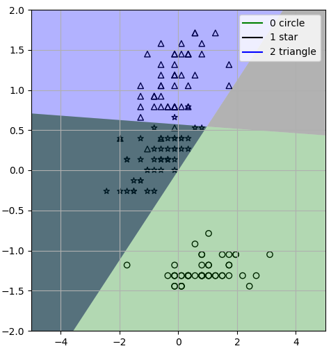

# 代码

1. 数据准备（正则化normalize 随机化shuffle）和绘图准备
2. 设置初始参数
3. 执行多分类（每轮清洗数据）（选取最优权值）
4. 去掉最差的超平面（hyperplane），填充颜色到分类后区域

# 多分类感知机的理解
1. 首先，简单的多分类感知机本质上是线性模型，所以不能分类线性不可分数据集，虽然口袋算法（pocket algorithm）or voted perceptron 能够做大致devided，但是扩展到复杂的多分类问题上就没有办法了。
2. perceptron 在分类时难以获得最优超平面（hyperplane）
3. 分类区域的选取（重叠(overlapping)区域的处理）
